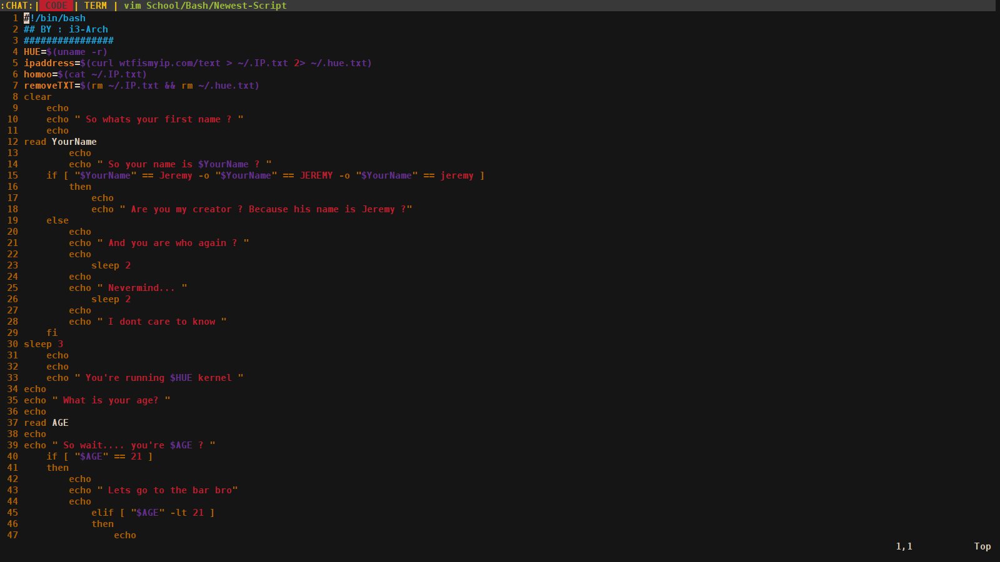

	DISCLAIMER

	* I took a little here and there from different peoples 
		* configs and made something I love   :)

				##################################################
				## Hope you enjoy 								##
				## Dont forget to check out  >>   blackarch.org ##
				##################################################

		1. Make sure you have i3-wm and i3status an stuff.
 			( configure your i3status.conf on your own )

				2. Let me know any feedback   :)

						3. I will update as needed 

Try Out An Archlinux Pentesting Distribution 
		Called Blackarch @ http://blackarch.org/download.html

	Join   #blackarch   on    
			
			irc.freenode.net  for any help 
					
					regarding blackarch distro
